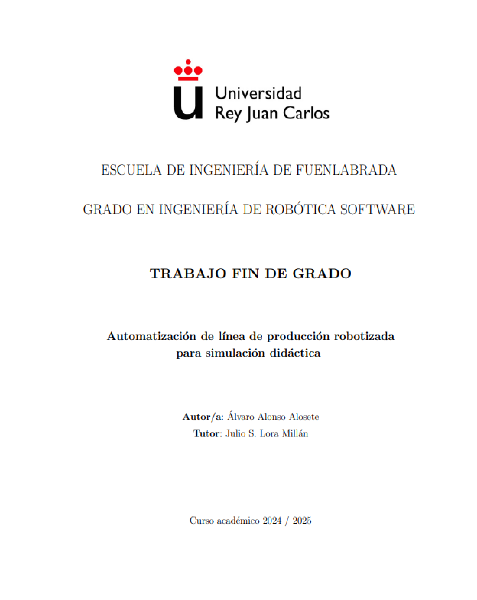

# TFG Automatización de línea de producción robotizada para simulación didáctica - Álvaro Alonso

Este proyecto se ha centrado en la integración de dos estaciones de Festo y un robot colaborativo UR5e mediante comunicaciones PROFINET, PLCs Siemens y HMI, desarrollando un sistema industrial funcional orientado a la formación técnica avanzada en automatización y robótica.

Se han aplicado metodologías como Grafcet y la Guía GEMMA para estructurar la lógica de control y se ha utilizado TIA Portal como entorno de desarrollo. El sistema final permite una operación sincronizada entre los dispositivos, incluyendo tareas de paletizado automatizado, y ha sido validado con éxito en entorno físico real.

Este trabajo representa una base sólida para seguir creciendo en el ámbito de la automatización industrial y la robótica colaborativa, sectores que me apasionan y en los que busco desarrollarme profesionalmente.

